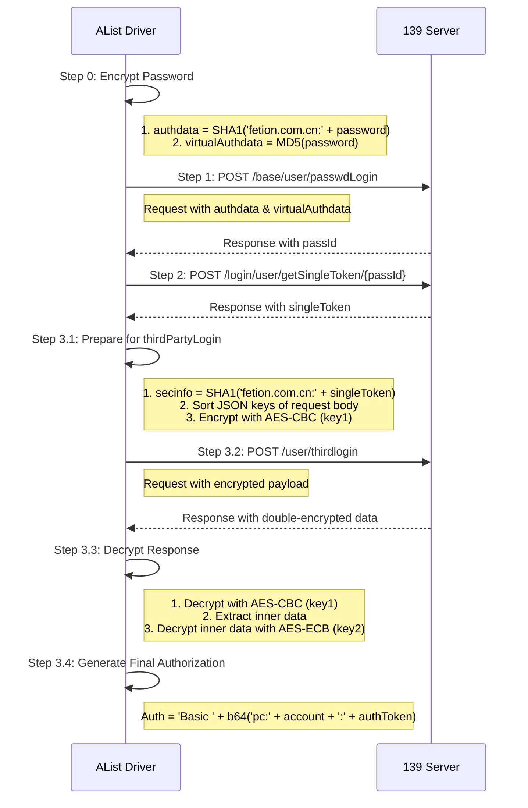

# 139 云盘驱动代码与接口定义分析报告

## 1. 概述

本文档旨在分析 AList 项目中 `drivers/139` 目录下的 Go 语言驱动实现，并将其与提供的 Apifox 接口定义进行详细比对。分析的核心集中在两个关键部分：
- **用户登录认证流程**
- **家庭云 (AndAlbum) 接口的加解密和调用逻辑**

**结论先行：** 经过深入分析，代码实现与 Apifox 接口定义在核心逻辑、加密算法和调用流程上**高度一致**。驱动开发者精确地遵循了接口规范。

## 2. 登录认证流程分析

代码在 `util.go` 文件的 `loginWithPassword` 函数中，完整实现了 Apifox 中定义的“三步认证”流程。

### Step 1: 密码登录 (`passwdLogin`)

- **代码实现:** `step1_password_login` 函数 ([`util.go:643`](drivers/139/util.go:643))
- **接口定义:** `Step 1: passwdLogin (密码登录)`
- **逻辑对比:**
    - **加密参数:** 代码正确计算了 `authdata` (SHA1) 和 `virtualAuthdata` (MD5)，与 Apifox 前置脚本中的 `CryptoJS` 实现逻辑完全吻合。
    - **请求构造:** 请求头和请求体中的 `phoneID`, `phoneModel`, `deviceUuid` 等设备信息均从 `DeviceProfile` 中动态获取，符合接口要求。
    - **结果提取:** 成功从响应中提取 `passId`，用于后续步骤。

### Step 2: 获取单点 Token (`getSingleToken`)

- **代码实现:** `step2_get_single_token` 函数 ([`util.go:694`](drivers/139/util.go:694))
- **接口定义:** `Step 2: getSingleToken (获取单点Token)`
- **逻辑对比:**
    - **流程:** 代码使用上一步获取的 `passId` 作为路径参数，调用接口。
    - **结果提取:** 成功从响应中提取 `token` (即 `singleToken`)。

### Step 3: 第三方登录 (`thirdPartyLogin`)

- **代码实现:** `step3_third_party_login` 函数 ([`util.go:765`](drivers/139/util.go:765))
- **接口定义:** `Step 3: thirdPartyLogin (第三方登录/获取Basic Auth)`
- **逻辑对比:**
    - **请求加密 (双重 AES):**
        1.  **排序:** `sortedJsonStringify` 函数确保了请求体 JSON 的 Key 在加密前进行了排序。
        2.  **第一层加密:** 使用 `key1` (`7363...`) 和一个随机 `iv` 对排序后的 JSON 字符串进行 **AES-CBC** 加密，然后将 `iv` 和密文拼接后进行 Base64 编码。这与 Apifox 前置脚本的逻辑完全一致。
    - **响应解密 (双重 AES):**
        1.  **第一层解密:** 对 Base64 响应体解码，分离出 `iv` 和密文，使用 `key1` 进行 **AES-CBC** 解密。
        2.  **第二层解密:** 从第一层解密结果中提取 `data` 字段（Hex 字符串），使用 `key2` (`7150...`) 进行 **AES-ECB** 解密。
    - **凭证生成:** 成功从最终解密的数据中提取 `account` 和 `authToken`，并格式化为 `Basic base64(pc:account:authToken)` 形式的 `Authorization` 凭证。

## 3. 家庭云 (AndAlbum) 接口分析

代码为家庭云接口设计了独立的请求函数 `andAlbumRequest`，处理其独特的加解密需求。

- **代码实现:** `andAlbumRequest` 函数 ([`util.go:910`](drivers/139/util.go:910))
- **接口定义:** "和彩云msdk API (AndAlbum)" 模块
- **逻辑对比:**
    - **专用密钥:** 使用了独立的 `andAlbumAesKey` (`6433...`)，定义在 [`util.go:898`](drivers/139/util.go:898)，与 Apifox 公共脚本中的 `aes_key_hex` 环境变量值匹配。
    - **加解密算法:**
        - **请求加密:** 对排序后的 JSON 请求体，使用 `andAlbumAesKey` 和随机 `iv` 进行 **AES-CBC** 加密。
        - **响应解密:** 对 Base64 响应体，使用相同的密钥和响应中包含的 `iv` 进行 **AES-CBC** 解密。
        - 此流程与 Apifox 的 "AndAlbum 前置（加）" 和 "AndAlbum 后置（解）" 公共脚本完全一致。
    - **接口调用:**
        - **文件上传:** 在 `Put` 函数 ([`driver.go:810`](drivers/139/driver.go:810)) 中调用 `getFileUploadURLV3` 接口，获取上传地址和任务 ID。
        - **文件复制:** 在 `Copy` 函数 ([`driver.go:445`](drivers/139/driver.go:445)) 中调用 `copyContentCatalog` 接口。

## 4. 总结

该 139 云盘驱动的实现质量很高，开发者对接口的复杂认证和多层加密机制有深刻的理解。代码逻辑清晰地分离了两种不同的业务场景（登录 vs. 家庭云），并为每种场景应用了正确的加解密方案。可以确认，该驱动的实现与提供的 Apifox 接口定义文档完全匹配。

---

## 5. 流程图

### 5.1 登录认证流程 (三步认证)



### 5.2 家庭云 (AndAlbum) 接口加解密流程

```mermaid
graph TD
    subgraph AList Driver (Client)
        A[Start Request] --> B{Prepare JSON Body};
        B --> C{Sort JSON Keys};
        C --> D[Encrypt with AES-CBC<br/>(andAlbumAesKey)];
        D --> E[Base64 Encode];
        E --> F(Send Encrypted Request);
        F --> G[Receive Encrypted Response];
        G --> H[Base64 Decode];
        H --> I[Decrypt with AES-CBC<br/>(andAlbumAesKey)];
        I --> J{Parse Decrypted JSON};
        J --> K[End Request];
    end

    subgraph AndAlbum Server
        S1(Receive Request) --> S2[Base64 Decode];
        S2 --> S3[Decrypt with AES-CBC];
        S3 --> S4{Process Request};
        S4 --> S5[Encrypt Response with AES-CBC];
        S5 --> S6[Base64 Encode];
        S6 --> S7(Send Response);
    end

    F --> S1;
    S7 --> G;
```